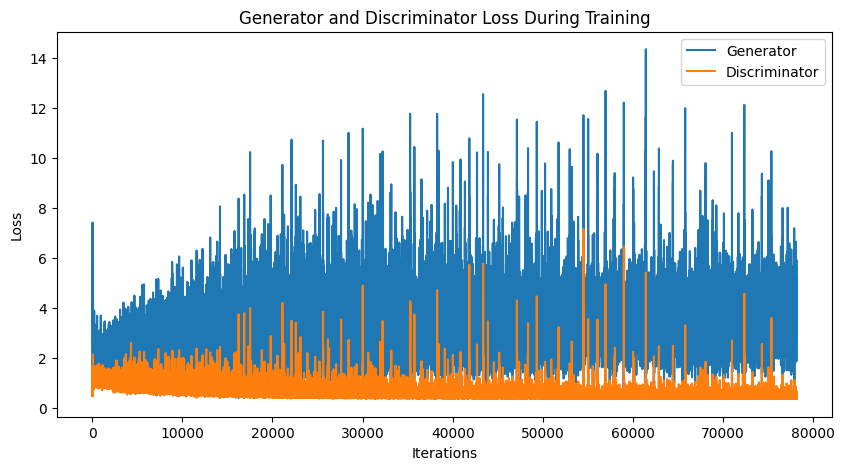
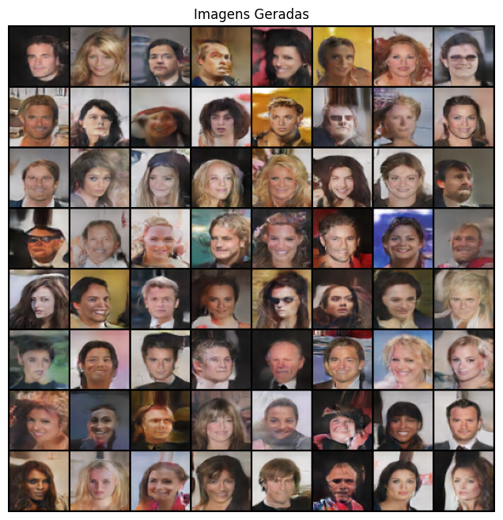
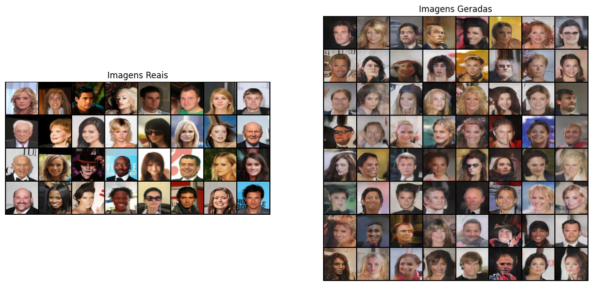
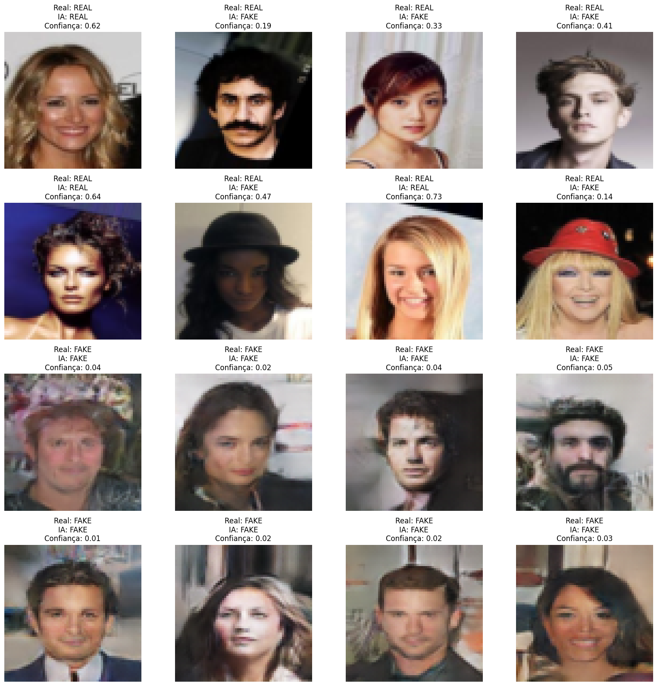

# 🎭 dcgan-faces

Rede Generativa Adversarial Convolucional (DCGAN) implementada em PyTorch para gerar imagens sintéticas de rostos humanos, treinada do zero no dataset CelebA.

## 🎯 Objetivo

Treinar um par Gerador/Discriminador em competição adversarial, de modo que o Gerador aprenda a criar imagens realistas de rostos a partir de ruído aleatório, sem nunca ter acesso direto às imagens reais — apenas ao sinal de erro vindo do Discriminador.

---

## 📊 Dataset

Foi utilizado o [**CelebA Dataset**](https://www.kaggle.com/datasets/jessicali9530/celeba-dataset), contendo mais de 200 mil fotos de rostos de celebridades.

Para viabilizar o treino no tempo disponível, foi utilizada uma amostra de **50.000 imagens**, redimensionadas para **64×64 pixels** e normalizadas para o intervalo [-1, 1].

---

## 🧠 Tecnologias e bibliotecas

- Python
- PyTorch / torchvision
- NumPy
- Matplotlib
- Kaggle Notebooks
- GPU (CUDA)

---

## 🔬 Metodologia

```text
Dataset CelebA (50.000 imagens, 64×64)
        ↓
Transformações (resize, crop, normalização)
        ↓
Gerador (ConvTranspose2d: ruído 100-d → imagem 64×64×3)
        ↓
Discriminador (Conv2d: imagem → probabilidade real/fake)
        ↓
Treino adversarial (50 épocas)
        ↓
Monitoramento das losses (Gerador vs Discriminador)
        ↓
Geração de amostras com ruído fixo
        ↓
Comparação visual: reais vs. geradas
        ↓
Teste final: Discriminador classificando reais e falsas
```

### 1. Arquitetura

**Gerador**: 5 camadas `ConvTranspose2d` (100 → 512 → 256 → 128 → 64 → 3 canais), com `BatchNorm2d` + `ReLU` entre elas e `Tanh` na saída.

**Discriminador**: 5 camadas `Conv2d` (3 → 64 → 128 → 256 → 512 → 1 canal), com `BatchNorm2d` + `LeakyReLU(0.2)` entre elas e `Sigmoid` na saída.

### 2. Treinamento

```text
Épocas:            50
Batch size:         32
Dimensão do ruído:  100
Loss:                BCELoss
Otimizador D:        Adam (lr=0.0001, betas=(0.5, 0.999))
Otimizador G:        Adam (lr=0.0003, betas=(0.5, 0.999))
Label smoothing:     rótulos reais suavizados para 0.9
Checkpoints:         salvos a cada 10 épocas
```

O Discriminador e o Gerador foram treinados alternadamente a cada batch, em uma disputa clássica de GAN: o Discriminador tenta distinguir reais de falsas, e o Gerador tenta enganá-lo.

### 3. Resultado do treinamento

Ao final das 50 épocas (último batch):

| Rede | Loss final |
|---|---:|
| Discriminador | 0,4722 |
| Gerador | 3,3569 |

A loss do Discriminador se manteve estável na faixa de ~0,4-0,5 ao longo de boa parte do treino, enquanto a do Gerador oscilou bastante, com picos de até ~14 — um padrão típico de treinamento adversarial, onde o equilíbrio entre as duas redes nunca é perfeitamente estável.

### 4. Teste qualitativo final

Em um teste com 16 imagens (8 reais + 8 geradas) passadas pelo Discriminador já treinado, ele classificou corretamente **11 de 16 (68,75%)** — acertando todas as 8 imagens falsas, mas errando em 5 das 8 imagens reais (classificadas como falsas com baixa confiança). Isso sugere que, nesta execução, o Discriminador ficou com um viés de desconfiança geral, mais propenso a rotular como "fake" — um efeito colateral comum quando o Gerador already produz imagens convincentes o suficiente para deslocar a fronteira de decisão do Discriminador.

---

## 📈 Principais resultados

- 50.000 imagens reais utilizadas no treino (CelebA, 64×64)
- Arquitetura DCGAN treinada do zero por 50 épocas
- Loss do Discriminador estabilizada em ~0,47
- Geração de rostos plausíveis e diversos, com traços faciais reconhecíveis
- 68,75% de acerto do Discriminador em teste qualitativo final (viés para classificar como "fake")

---

## 🖼️ Visualizações

As principais figuras geradas durante o experimento estão organizadas na pasta `imagens/`.

### Evolução da loss (Gerador vs. Discriminador)



### Imagens geradas pela rede ao final do treino



### Comparação lado a lado: reais vs. geradas



### Teste final do Discriminador (real vs. fake, com confiança)



---

## 📁 Estrutura do projeto

```text
dcgan-faces/
│
├── README.md
├── dcgan_faces.ipynb
├── requirements.txt
│
└── imagens/
    ├── curva_loss.png
    ├── imagens_geradas.png
    ├── reais_vs_geradas.png
    └── teste_discriminador.png
```

---

## 🚀 Como Executar

1. Crie um novo notebook no **Kaggle**
2. Adicione o dataset `jessicali9530/celeba-dataset` em **Add Input**
3. Faça upload do `dcgan_faces.ipynb`
4. Ative a GPU em **Settings → Accelerator**
5. Execute as células em ordem (o treino completo leva cerca de 1h-2h30, variando com a GPU disponível)

Para rodar localmente:

```bash
pip install -r requirements.txt
```

---

## ⚠️ Limitações

- A loss do Gerador apresenta picos de instabilidade ao longo do treino (visível no gráfico), típico de treinamento adversarial sem técnicas adicionais de estabilização (ex: Wasserstein loss, gradient penalty).
- A avaliação de GANs é inerentemente qualitativa — não existe uma métrica única e definitiva de "acurácia"; o teste do Discriminador serve como indicador, não como medida objetiva de qualidade das imagens, e seu resultado varia entre execuções (13/16 em uma rodada anterior, 11/16 nesta).
- O treino usa uma arquitetura DCGAN clássica, mais simples que abordagens atuais (StyleGAN, Diffusion Models), o que limita a nitidez e resolução das imagens geradas (64×64).

---

## 🔮 Possíveis melhorias futuras

- Calcular métricas quantitativas como FID (Fréchet Inception Distance)
- Testar Wasserstein GAN com gradient penalty (WGAN-GP) para maior estabilidade
- Aumentar a resolução de saída (128×128 ou 256×256)
- Re-treinar periodicamente o Discriminador com exemplos recentes do Gerador para reduzir o viés observado no teste final

---

## 👨‍💻 Projeto acadêmico

Projeto desenvolvido como parte dos estudos em **Ciência de Dados**, com foco em Redes Generativas Adversariais (GANs) e Deep Learning aplicado à geração de imagens.
